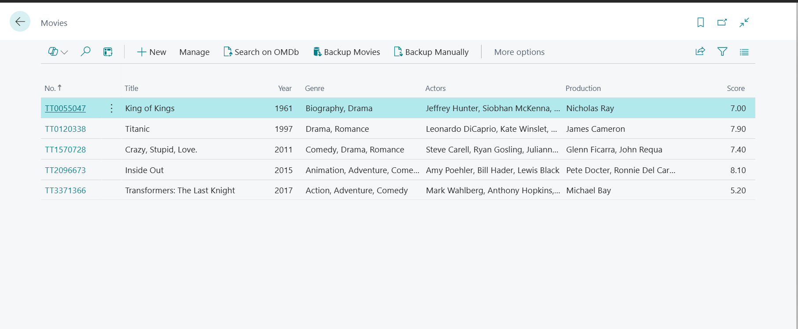
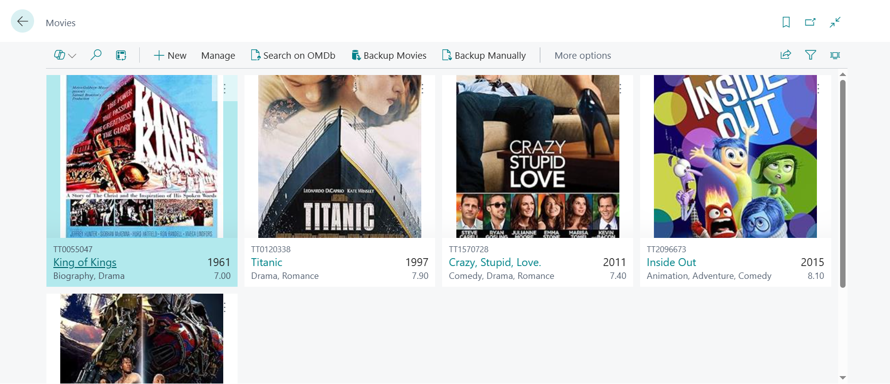
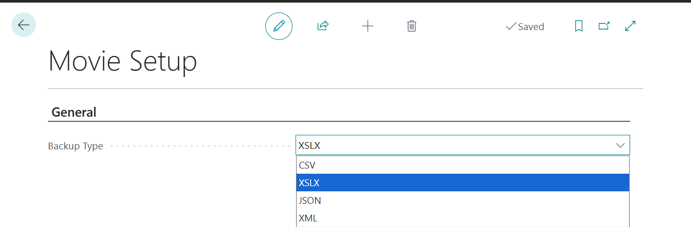
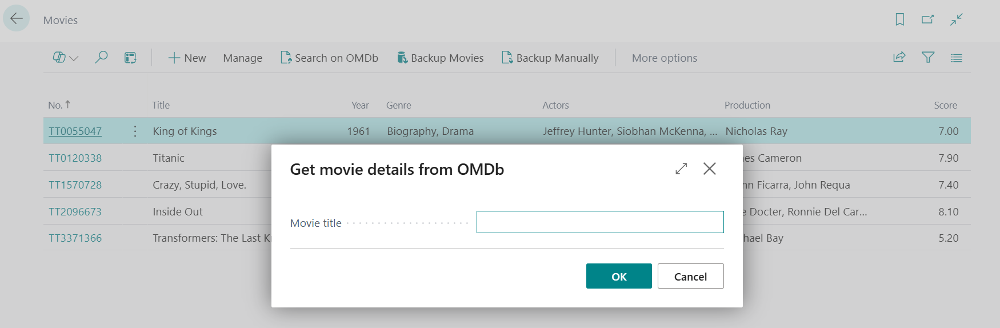
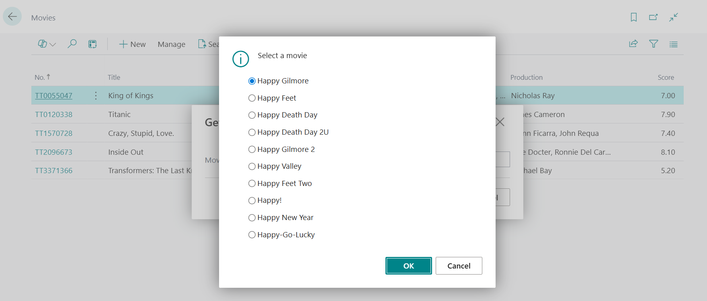
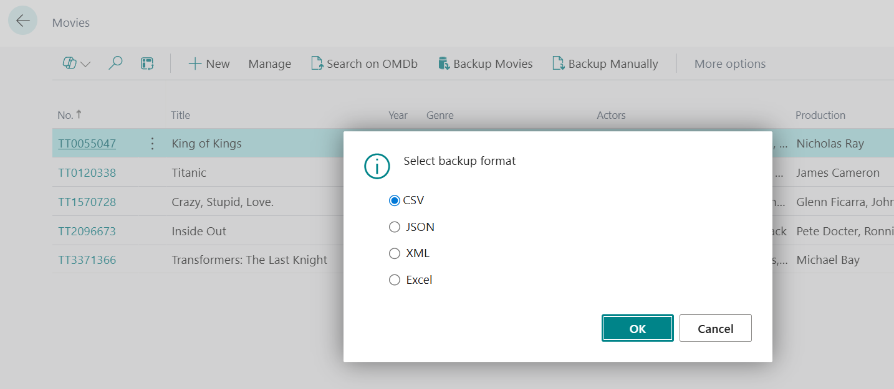

# 🎬 Movie Database – Business Central Extension

This is a custom extension built for **Microsoft Dynamics 365 Business Central** to manage and import a catalog of movies using the [OMDb API](http://www.omdbapi.com/).

---

## 🔍 Features

- Search for movies directly from Business Central using the OMDb API.
- Store selected movie data in a custom table (`Movie`).
- View movie details in both **List** and **Tile** formats.
- Export movie data in multiple formats:
  - CSV
  - XLSX
  - JSON
  - XML
- Manual backup option via a dialog menu.

---

## 🗂️ Project Structure

| Folder / File                         | Description                                      |
|--------------------------------------|--------------------------------------------------|
| `Tables/`                            | Custom movie-related data tables                 |
| `Pages/`                             | User interface elements (list, card pages)       |
| `Codeunits/`                         | Business logic components (API integration, etc) |
| `Interfaces/`                        | Interfaces used for backup/export implementation|
| `Enums/`                             | Export format options                            |
| `MoviesPermissions.permissionset.al` | Permission set definition                        |
| `Cronus_Movie Database_1.0.0.0.app`  | Published `.app` package for deployment          |

---

## ⚙️ Use Case

This extension was created as part of my technical development in **AL language**, focusing on:

- Integration with external APIs,
- Modular design using interfaces,
- Enhancing user interaction in Business Central.

It demonstrates how to integrate third-party APIs (like OMDb) and design extensible backup/export features following best practices in AL.

---

## 🧪 Key Concepts Practiced

- API integration using `HttpClient` in AL
- JSON parsing and data mapping
- Separation of concerns via Interfaces and Codeunits
- Enum-based export feature
- Creation of Pages, Tables, and Permission Sets
- Packaging and publishing `.app` files

---

## 📸 Screenshots

> Below are screenshots showing key functionalities of the extension inside Business Central.

### 🎞️ Movie List – List View

### 🎞️ Movie List – Tile View

### 🧰 Movie Setup

### 🔍 OMDb Search Dialog

### 📋 OMDb Search Results

### 💾 Manual Backup – Dialog Menu Options

---

## 📘 Lessons Learned

While developing this project, I had the opportunity to learn and apply several technical and design concepts:

- Understanding how to decouple logic using Interfaces and Codeunits was a valuable lesson.
- API integration with proper error handling and JSON deserialization required attention to detail.
- Exporting data to formats like XLSX using only AL was particularly challenging and insightful.
- I realized the importance of designing modular and maintainable extensions in a Business Central context.

> If I were to rebuild this project, I would focus more on adding automated tests and improving the user interface with additional visual feedback.

---

## 📦 Deployment

To install this extension:

1. Upload the `.app` file (`Cronus_Movie Database_1.0.0.0.app`) to your Business Central sandbox or environment.
2. Assign the appropriate permission set (`MoviesPermissions`) to the intended users.
3. Open the Movie List page and start searching for your favorite movies!

---

### 🔗 Back to [My Portfolio](https://github.com/anneliseayres/Portfolio)
